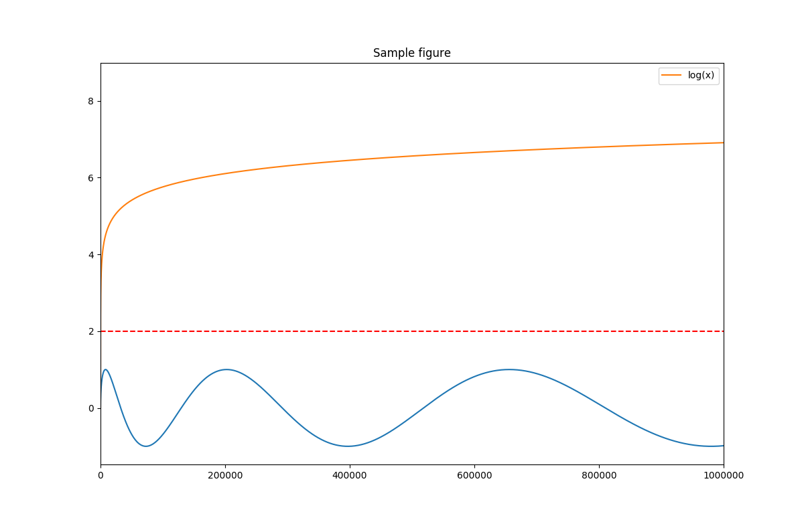
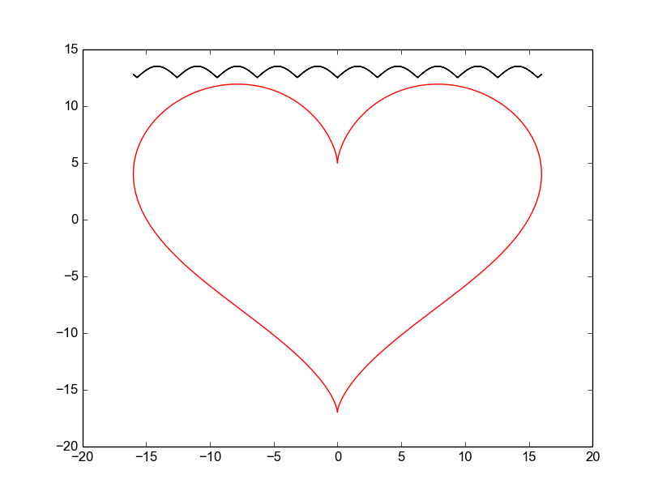

matplotlib-cpp
==============

This is matplotlib-cpp, probably the simplest C++ plotting library.
It is built to resemble the plotting API used by Matlab and matplotlib.

Usage
-----
Complete minimal example:

    #include "matplotlibcpp.h"
    namespace plt = matplotlibcpp;
    int main() {
        plt::plot({1,2,3,4});
        plt::show();
    }
    
    // g++ minimal.cpp -std=c++11 -lpython2.7

Result: 

A more comprehensive example:

    #include "matplotlibcpp.h"
    #include <cmath>

    namespace plt = matplotlibcpp;

    int main() 
    {
        // Prepare data.
        int n = 5000;
        std::vector<double> x(n), y(n), z(n), w(n,2);
        for(int i=0; i<n; ++i) {
            x.at(i) = i*i;
            y.at(i) = sin(2*M_PI*i/360.0);
            z.at(i) = log(i);
        }

        // Plot line from given x and y data. Color is selected automatically.
        plt::plot(x, y);
        // Plot a red dashed line from given x and y data.
        plt::plot(x, w,"r--");
        // Plot a line whose name will show up as "log(x)" in the legend.
        plt::named_plot("log(x)", x, z);

        // Set x-axis to interval [0,1000000]
        plt::xlim(0, 1000*1000);
        // Enable legend.
        plt::legend();
        // Show plot
        plt::show();
    }

    // g++ basic.cpp -lpython2.7

Result: 

matplotlib-cpp doesn't require C++11, but will enable some additional syntactic sugar when available:

    #include <cmath>
    #include "matplotlibcpp.h"

    using namespace std;
    namespace plt = matplotlibcpp;

    int main() 
    {    
        // Prepare data.
        int n = 5000; // number of data points
        vector<double> x(n),y(n); 
        for(int i=0; i<n; ++i) {
            double t = 2*M_PI*i/n;
            x.at(i) = 16*sin(t)*sin(t)*sin(t);
            y.at(i) = 13*cos(t) - 5*cos(2*t) - 2*cos(3*t) - cos(4*t);
        }

        // plot() takes an arbitrary number of (x,y,format)-triples. 
        // x must be iterable (that is, anything providing begin(x) and end(x)),
        // y must either be callable (providing operator() const) or iterable. 
        plt::plot(x, y, "r-", x,  { return 12.5+abs(sin(d)); }, "k-");

        // show plots
        plt::show();
    }    

Result: 

Installation
------------
matplotlib-cpp works by wrapping the popular python plotting library matplotlib. (matplotlib.org)
This means you have to have a working python installation, including development headers.
On Ubuntu:

    sudo aptitude install python-matplotlib python2.7-dev

The C++-part of the library consists of the single header file `matplotlibcpp.h` which can be placed
anywhere.
Since a python interpreter is opened internally, it is necessary to link against `libpython2.7` in order to use
matplotlib-cpp.
(There should be no problems using python3 instead of python2.7, if desired)

Todo/Issues/Wishlist
--------------------
* It would be nice to have a more object-oriented design with a Plot class which would allow
  multiple independent plots per program.

* Right now, only a small subset of matplotlibs functionality is exposed. Stuff like save()/xlabel()/ylabel() etc. should
  be easy to add.

* A lot of copying could be avoided if we generate numpy arrays directly instead of python lists
